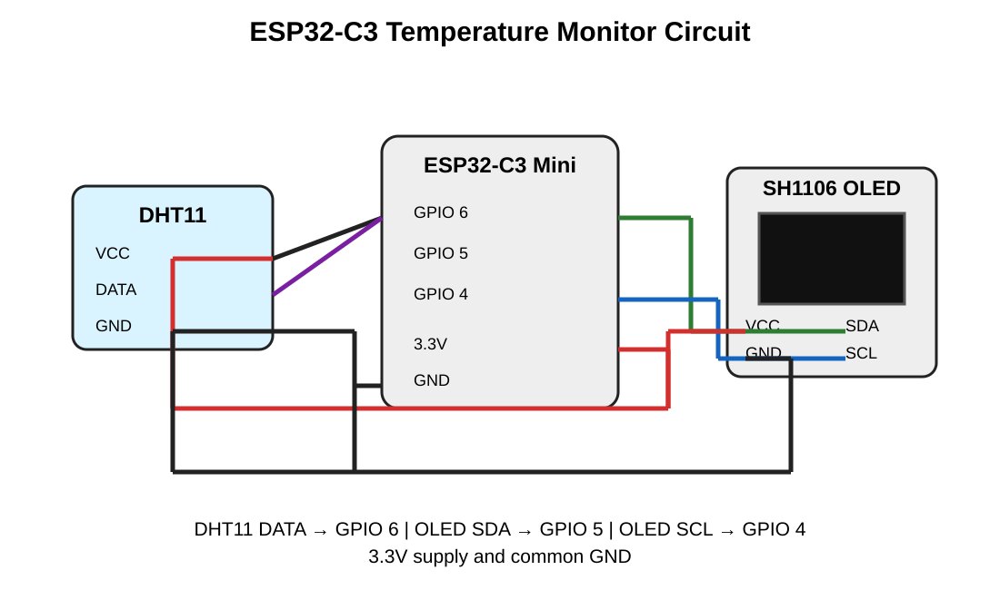

# 🌡️ ESP32 IoT Temperature & Humidity Monitor

An IoT-based temperature and humidity monitoring system using an **ESP32-C3 Mini**, **DHT11 sensor**, **SH1106 OLED display**, and **Blynk IoT**. The system displays sensor readings locally and sends them to a Blynk dashboard for remote monitoring.

## 🔧 Components Used

- ESP32-C3 Mini
- DHT11 Temperature & Humidity Sensor
- 1.3-inch SH1106 I2C OLED Display
- Wi-Fi connection
- Blynk IoT platform
- Jumper wires
- Breadboard

## ✨ Features

- Real-time temperature measurement
- Real-time humidity measurement
- OLED local display
- Wi-Fi connectivity
- Blynk IoT remote monitoring
- Temperature status classification
- High-temperature danger notification
- One-time alert logic to avoid repeated notifications

## 🌡️ Temperature Status

| Temperature | Status |
|---:|---|
| Below 29°C | LOW |
| 29°C – 35°C | NORMAL |
| Above 35°C – 40°C | MID |
| Above 40°C | DANGER |

When the temperature exceeds **40°C**, the system sends a Blynk event notification.

## 🔌 Circuit Connections

| Component | Pin | ESP32-C3 Mini |
|---|---|---|
| DHT11 | VCC | 3.3V |
| DHT11 | DATA | GPIO 6 |
| DHT11 | GND | GND |
| SH1106 OLED | VCC | 3.3V |
| SH1106 OLED | SDA | GPIO 5 |
| SH1106 OLED | SCL | GPIO 4 |
| SH1106 OLED | GND | GND |

### Circuit Diagram



## 📱 Blynk IoT

The ESP32 sends:

- **V0** → Temperature (°C)
- **V1** → Humidity (%)

Create a Blynk event named:

`danger_temperature`

The event is triggered when the measured temperature rises above 40°C.

## ⚙️ Working Principle

The DHT11 sensor measures the surrounding temperature and humidity. The ESP32-C3 Mini reads these values every 3 seconds and determines the temperature status. The readings are shown on the SH1106 OLED display and transmitted over Wi-Fi to the Blynk IoT platform. If the temperature exceeds 40°C, the system displays a danger indication and sends a Blynk notification.

## 📚 Required Arduino Libraries

Install these libraries through the Arduino IDE Library Manager:

- Blynk
- DHT sensor library
- U8g2

The ESP32 board package is also required.

## 🔐 Configuration

Before uploading the code, replace the following placeholders with your own credentials:

```cpp
#define BLYNK_TEMPLATE_ID "YOUR_TEMPLATE_ID"
#define BLYNK_TEMPLATE_NAME "ESP32 Temperature Monitor"
#define BLYNK_AUTH_TOKEN "YOUR_AUTH_TOKEN"

char ssid[] = "YOUR_WIFI_NAME";
char pass[] = "YOUR_WIFI_PASSWORD";
```

**Do not publish your real Wi-Fi password or Blynk authentication token in a public repository.**

## 🚀 Applications

- Room temperature monitoring
- Laboratory monitoring
- Equipment/environment monitoring
- IoT learning projects
- Remote temperature monitoring

## 🔮 Future Enhancements

- Telegram/WhatsApp alerts
- Temperature data logging
- Historical graphs
- Automatic fan/cooling control
- Multiple sensor support
- Web-based monitoring dashboard

## 👨‍💻 Author

**Siva Sahoo**

Electrical Engineering | Embedded Systems | IoT
